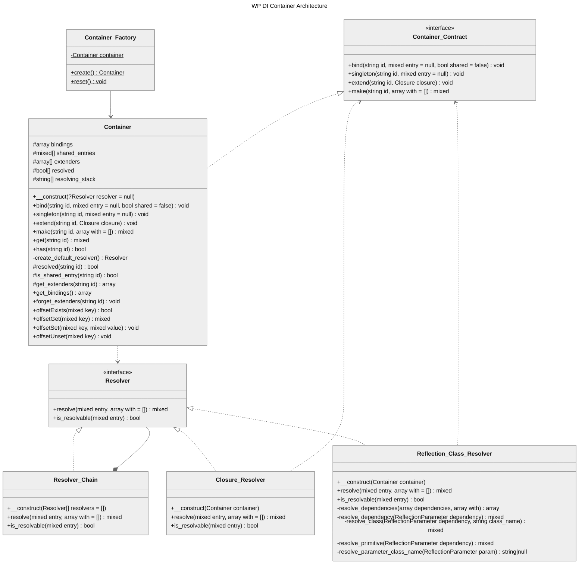

# Architecture

This page describes the components that make up WP DI Container and how they collaborate.

## UML Diagram



## Components

### Core

| Class | Role |
|---|---|
| `Container` | Central class. Manages bindings, shared entries, extenders, and resolves dependencies. Implements `ContainerInterface` and `ArrayAccess`. |
| `Container_Factory` | Static factory that manages a single shared `Container` instance across your entire plugin or theme. |

### Resolver System

| Class | Role |
|---|---|
| `Resolver` (interface) | Contract for dependency resolution. Defines `resolve()` and `is_resolvable()`. |
| `Resolver_Chain` | Chains resolvers to handle dependency resolution in sequence. Tries each resolver until one succeeds. |
| `Reflection_Class_Resolver` | Resolves class dependencies using PHP's Reflection API. Handles constructor injection, default values, and `self`/`parent` type hints. |
| `Closure_Resolver` | Resolves an entry by invoking closures with the container and optional parameters. |

### Contracts

| Interface | Role |
|---|---|
| `Container` (contract) | Defines the full container API: `bind()`, `singleton()`, `extend()`, `make()`. Extends PSR-11 `ContainerInterface` and `ArrayAccess`. |
| `Resolver` | Defines the resolver contract: `resolve()` and `is_resolvable()`. |

### Exceptions

| Class | Extends | When Thrown |
|---|---|---|
| `Failed_Resolution_Exception` | `RuntimeException` | Circular dependencies, unresolvable entries, uninstantiable classes, unresolvable primitives. |
| `Entry_Not_Found_Exception` | `InvalidArgumentException` | `get()` is called for an identifier with no binding. |

## Resolution Flow

```
$container->make( My_Service::class )
│
├─ Check shared entries                ← Return cached singleton if available
├─ Check circular dependency           ← Throw if already resolving this entry
│
├─ Resolver_Chain::resolve()
│   ├─ Reflection_Class_Resolver       ← If entry is a class/interface string
│   │   ├─ Check instantiable          ← Throw if interface/abstract without binding
│   │   ├─ Resolve constructor params  ← Recursively resolve typed dependencies
│   │   └─ Return new instance
│   │
│   └─ Closure_Resolver                ← If entry is a Closure
│       └─ Invoke closure( $container, $with )
│
├─ Apply extenders                     ← Run registered extend() closures in order
├─ Cache if singleton                  ← Store in shared_entries for next call
└─ Return resolved object
```

## Next Steps

- **[Introduction](./01-introduction.md)**: Overview, features, and quick start.
- **[Container](./03-container.md)**: Binding, resolving, singletons, extensions, and factory.
- **[Exceptions](./04-exceptions.md)**: Error handling reference.
